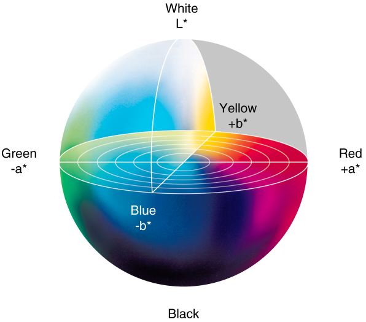

# Image Colorization with Generative Adversarial Networks 
This repository explores the method of colorization using generative adversarial networks (GANs).
The colorization is done using two convolutional networks to as suggested by [Pix2Pix](https://github.com/phillipi/pix2pix).

The network is trained on the datasets [CIFAR-10](https://www.cs.toronto.edu/~kriz/cifar.html) and [Places365](http://places2.csail.mit.edu). Some of the results from Places365 dataset are [shown here](#places365-results)

## Prerequisites
- Linux
- Tensorflow 1.4
- Keras
- NVIDIA GPU (12G or 24G memory) + CUDA cuDNN

## Getting Started
### Installation
- Install Tensorflow and dependencies from https://www.tensorflow.org/install/
- Install Keras libraries [Keras](https://github.com/keras-team/keras).
```bash
sudo pip install keras
```
- Clone this repo:
```bash
git clone https://github.com/ImagingLab/Colorizing-with-GANs.git
cd Colorizing-with-GANs
```

### Dataset
- We use the [CIFAR-10](https://www.cs.toronto.edu/~kriz/cifar.html) and [Places365](http://places2.csail.mit.edu) datasets. To train a model on the full dataset, please download datasets from official websites.
After downloading, please put it under the `datasets` folder in the same way the sub-directories are provided.

## Method
### Additive vs. Subtractive Color Spaces
Traditionally, digital color images are represented using the red, green, blue color channels (RGB). This is known as an additive color space as the source of the colors originate from emitted light. On the contrary, subtractive color spaces draw their colors from reflected light (i.e. pigments). For this project, the image data will be based on L*a*b* subtractive color space. L*a*b* contain dedicated channels depict the brightness of the image in its respective color space. The color information are fully encoded in the remaining two channels. As a result, this prevents any sudden variations in both color and brightness through small perturbations in intensity values that are experienced through RGB. 

The L*a*b* color space can be viewed as a three dimensional space with L*, a*, b* as the coordinate axis. The L* axis controls the black and white levels (L* = 0 and L* = 100 respectively), the a* axis is a gradient between green and red, and the b* axis is a gradient between blue and yellow. A visualization of the distribution of color can be seen in the following figure:
<p align='center'>  
  
</p>

### Generative Adversarial Network
Since colorization is a class of image translation problems, the architectures of the generator and discriminator both follow a multilayer perceptron model. The generator is trained to minimize the probability that the discriminator makes a correct prediction in generated data, while discriminator is trained to maximize the probability of assigning the correct label. This is presented as a single minimax game problem with the value function V (G, D):
<p align='center'>  
  
</p>
In our model, we have decided to use an alternate cost function for the generator. In the above equation, the cost function is defined by minimizing the probability of the discriminator being correct. However, this approach presents two issues: 1) If the discriminator performs well during training stages, the generator will have a near-zero gradient during back-propagation. This will tremendously slow down convergence rate because the generator will continue to produce similar results during training. 2) The original cost function is a strictly decreasing function that is unbounded below. This will cause the cost function to diverge to negative infinity during the minimization procedure. To address the above issues, we have redefined the generator's cost function by maximizing the probability of the discriminator being mistaken, as opposed to minimizing the probability of the discriminator being correct. In addition, the cost function was further modified by adding an L1 based regularizer. This will theoretically preserve the structure of the original images and prevent the generator from assigning arbitrary colors to pixels just to fool the discriminator:
<p align='center'>  
  
</p>

### Conditional GAN
In a traditional GAN, the input of the generator is randomly generated noise data z. However, this approach is not applicable to the automatic colorization problem due to the nature of its inputs. The generator must be modified to accept grayscale images as inputs rather than noise. This problem was addressed by using a variant of GAN called [conditional generative adversarial networks](https://arxiv.org/abs/1411.1784). Since no noise is introduced, the input of the generator is treated as zero noise with the grayscale input as a prior. In addition, the input of the discriminator was also be modified to accommodate for the conditional network. By introducing these modifications, our final cost functions are as follows:
<p align='center'>  
  
</p>
The discriminator gets colored images from both generator and original data along with the grayscale input as the condition and tries to tell which pair contains the true colored image:
<p align='center'>  
  
</p>

## Networks Architecture
The architecture of generator is the same as  [U-Net](https://arxiv.org/abs/1505.04597):  5 encoding units and 5 decoding units. The contracting path has the typical architecture of a convolutional networks: 3x3 convolution layers, each followed by batch normalization, leaky rectified linear unit (leaky ReLU) activation function and 2x2 max pooling operation with stride 2 for downsampling. The number of channels are doubled after each downsampling step. Each unit in the expansive path consists of an upsampling layer, followed by a 2x2 convolution layer that halves the number of channels, concatenation with the activation map of the mirroring layer in the contracting path, and two 3x3 convolution layers each followed by batch normalization and ReLU activation function. The last layer of the network is a 1x1 convolution which is equivalent to cross-channel parametric pooling layer. The number of channels in the output layer is 3 with L*a*b* color space.
<p align='center'>  
  
</p>

For discriminator, we use a conventional convolutional neural network classifier architecture: a series of 3x3 convolutional layers followed by max-pooling layer with the number of channels being doubled after each downsampling. All convolution layers are followed by batch normalization, leaky ReLU activation with slope 0.2 and dropout with a dropout rate of 20% to prevent the discriminator from overfitting. After the last layer, a convolution is applied to map to a 1 dimensional output, followed by a sigmoid function to return a probability value of the input being real or fake. 
<p align='center'>  
  
</p>
  
## Places365 Results
Colorization results with Places365. (a) Grayscale. (b) Original Image. (c) Colorized with GAN.
<p align='center'>  
  
</p>
