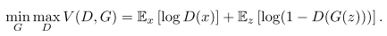
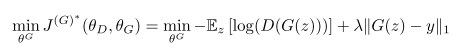
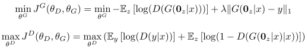
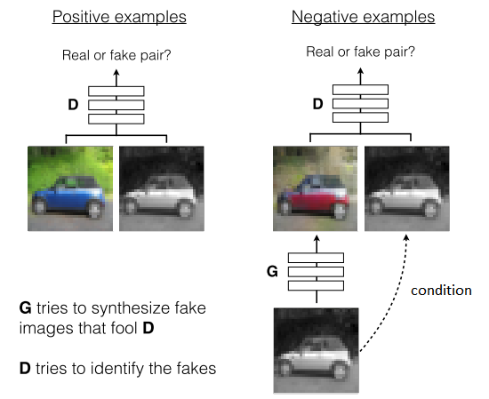
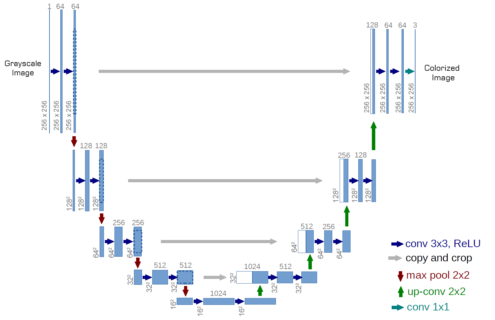
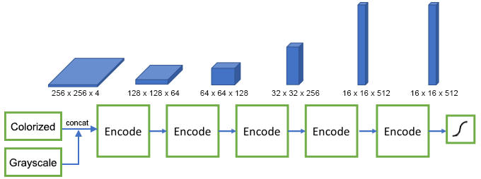
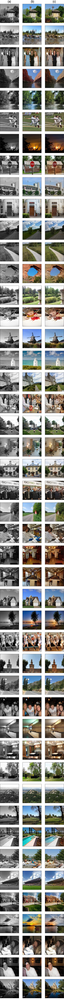

# Image Colorization with Generative Adversarial Networks 
In this work, we generalize the colorization procedure using a conditional Deep Convolutional Generative Adversarial Network (DCGAN) as as suggested by [Pix2Pix]. The network is trained on the datasets [CIFAR-10](https://www.cs.toronto.edu/~kriz/cifar.html) and [Places365](http://places2.csail.mit.edu). Some of the results from Places365 dataset are [shown here.](#places365-results)

## Prerequisites
- Linux
- Tensorflow 1.7
- NVIDIA GPU (12G or 24G memory) + CUDA cuDNN

## Getting Started
### Installation
- Clone this repo:
```bash
git clone https://github.com/ImagingLab/Colorizing-with-GANs.git
cd Colorizing-with-GANs
```
- Install Tensorflow and dependencies from https://www.tensorflow.org/install/
- Install python requirements:
```bash
pip install -r requirements.txt
```

### Dataset
- We use [CIFAR-10](https://www.cs.toronto.edu/~kriz/cifar.html) and [Places365](http://places2.csail.mit.edu) datasets. To train a model on the full dataset, download datasets from official websites.
After downloading, put then under the `datasets` folder.

### Training
- To train the model, run `main.py` script
```bash
python main.py
```
- To train the model on places365 dataset with tuned hyperparameters:
```
python train.py \
  --seed 100 \
  --dataset places365 \
  --dataset-path ./dataset/places365 \
  --checkpoints-path ./checkpoints \
  --batch-size 16 \
  --epochs 10 \
  --lr 3e-4 \
  --label-smoothing 1
  
```

- To train the model of cifar10 dataset with tuned hyperparameters:
```
python train.py \
  --seed 100 \
  --dataset cifar10 \
  --dataset-path ./dataset/cifar10 \
  --checkpoints-path ./checkpoints \
  --batch-size 128 \
  --epochs 200 \
  --lr 3e-4 \
  --lr-decay-steps 1e4 \
  --augment True
  
```

### Evaluate
- Download the pre-trained weights [from here.](https://drive.google.com/open?id=1jTsAUAKrMiHO2gn7s-fFZ_zUSzgKoPyp) and copy them in the `checkpoints` folder.
- To evaluate the model quantitatively on the test-set, run `test-eval.py` script:
```bash
python test-eval.py
```

### Turing Test
- Download the pre-trained weights [from here.](https://drive.google.com/open?id=1jTsAUAKrMiHO2gn7s-fFZ_zUSzgKoPyp) and copy them in the `checkpoints` folder.
- To evaluate the model qualitatively using visual Turing test, run `test-turing.py`:
```bash
python test-turing.py
```

- To apply time-based visual Turing test run (2 seconds decision time):
```bash
python test-turing.py --test-delay 2
```


## Method

### Generative Adversarial Network
Both generator and discriminator use CNNs. The generator is trained to minimize the probability that the discriminator makes a correct prediction in generated data, while discriminator is trained to maximize the probability of assigning the correct label. This is presented as a single minimax game problem:
<p align='center'>  
  
</p>
In our model, we have redefined the generator's cost function by maximizing the probability of the discriminator being mistaken, as opposed to minimizing the probability of the discriminator being correct. In addition, the cost function was further modified by adding an L1 based regularizer. This will theoretically preserve the structure of the original images and prevent the generator from assigning arbitrary colors to pixels just to fool the discriminator:
<p align='center'>  
  
</p>

### Conditional GAN
In a traditional GAN, the input of the generator is randomly generated noise data z. However, this approach is not applicable to the automatic colorization problem due to the nature of its inputs. The generator must be modified to accept grayscale images as inputs rather than noise. This problem was addressed by using a variant of GAN called [conditional generative adversarial networks](https://arxiv.org/abs/1411.1784). Since no noise is introduced, the input of the generator is treated as zero noise with the grayscale input as a prior:
<p align='center'>  
  
</p>
The discriminator gets colored images from both generator and original data along with the grayscale input as the condition and tries to tell which pair contains the true colored image:
<p align='center'>  
  
</p>

### Networks Architecture
The architecture of generator is inspired by  [U-Net](https://arxiv.org/abs/1505.04597):  The architecture of the model is symmetric, with `n` encoding units and `n` decoding units. The contracting path consists of 4x4 convolution layers with stride 2 for downsampling, each followed by batch normalization and Leaky-ReLU activation function with the slope of 0.2. The number of channels are doubled after each step. Each unit in the expansive path consists of a 4x4 transposed convolutional layer with stride 2 for upsampling, concatenation with the activation map of the mirroring layer in the contracting path, followed by batch normalization and ReLU activation function. The last layer of the network is a 1x1 convolution which is equivalent to cross-channel parametric pooling layer. We use `tanh` function for the last layer.
<p align='center'>  
  
</p>

For discriminator, we use similar architecture as the baselines contractive path: a series of 4x4 convolutional layers with stride 2 with the number of channels being doubled after each downsampling. All convolution layers are followed by batch normalization, leaky ReLU activation with slope 0.2. After the last layer, a convolution is applied to map to a 1 dimensional output, followed by a sigmoid function to return a probability value of the input being real or fake
<p align='center'>  
  
</p>
  
## Places365 Results
Colorization results with Places365. (a) Grayscale. (b) Original Image. (c) Colorized with GAN.
<p align='center'>  
  
</p>

## Citation
If you use this code for your research, please cite our paper <a href="https://arxiv.org/abs/1803.05400">Image Colorization with Generative Adversarial Networks</a>:

```
@inproceedings{nazeri2018image,
  title={Image Colorization Using Generative Adversarial Networks},
  author={Nazeri, Kamyar and Ng, Eric and Ebrahimi, Mehran},
  booktitle={International Conference on Articulated Motion and Deformable Objects},
  pages={85--94},
  year={2018},
  organization={Springer}
}
```
